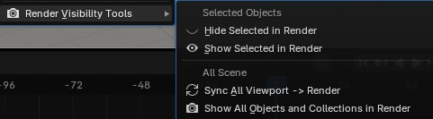

# Render Visibility Tools

A small Blender addon to quickly manage render visibility for selected objects, scene objects, and collections.

It was created from a real Blender project that became heavy, with many objects and an Outliner that was not always as clean as planned.

> For Blender scenes that start well organized... and somehow end up with 400 objects and an Outliner telling another story.

## Why this addon?

Blender already provides several ways to manage render visibility, including the Outliner, visibility icons, shortcuts, and context operations.

This addon does not try to replace Blender's native tools. Its goal is simply to group a few practical commands into one clear menu, to save time in heavy scenes, test renders, or projects where the Outliner is not always as organized as planned.

## Features

The addon adds a menu here:

`Object > Render Visibility Tools`

### Selected Objects

- **Hide Selected in Render**  
  Disables render visibility for the selected objects.

- **Show Selected in Render**  
  Enables render visibility for the selected objects.

### All Scene

- **Sync All Viewport -> Render**  
  Sets render visibility according to the current viewport visibility for all scene objects.

- **Show All Objects and Collections in Render**  
  Makes all objects and collections in the current scene visible for render.

## Installation

1. Download the ZIP file.
2. In Blender, open `Edit > Preferences > Add-ons`.
3. Click `Install`.
4. Select the ZIP file or `render_visibility_tools.py`.
5. Enable **Render Visibility Tools**.

## Notes

This first version intentionally stays simple, with a focus on object and collection render visibility.

Further features may be added later, depending on real-world use and user feedback.

## Compatibility

Designed for Blender 3.6 and later.

## License

MIT License.

## Author

Created by 3DLP, with AI assistance.